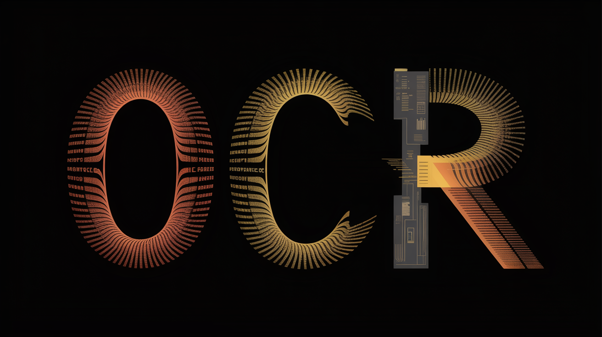

# 📝 OCR Drag-N-Drop Tool (Work in Progress)

> 🔍 Extract text from images with a simple drag and drop!

⚠️ **WORK IN PROGRESS** ⚠️ This tool is actively being developed. While
functional, we're continuously adding features and improvements. We welcome
contributions from the community!

## ✨ Features

🎯 **Simple to Use**

- Just drag & drop images onto the window
- Process entire folders with one click
- Real-time text extraction

🚀 **Powerful Processing**

- Batch process multiple images
- Support for all common image formats
- Live progress tracking

💾 **Easy Export**

- Save extracted text to files
- Clean, formatted output
- Automatic file handling

## 🛠️ Setup

### Prerequisites

- ✅ Python 3.6+
- ✅ Tesseract OCR
- ✅ PySide6, OpenCV, pytesseract

### 📥 Installation

1. **Install Tesseract OCR**

   ```bash
   # Windows: Download from Tesseract GitHub
   # Linux
   sudo apt-get install tesseract-ocr
   # Mac
   brew install tesseract
   ```

2. **Set Up Project**

   ```bash
   # Clone repo
   git clone [repository-url]
   cd OCR-DRAG-N-Drop-Tool
   ```

3. **Automated Setup Scripts** We provide automated setup scripts that will:

   - Create a Python virtual environment
   - Install all required dependencies
   - Configure Tesseract OCR path
   - Launch the application

   Choose your platform:

   ```bash
   # Windows: Double-click or run in terminal
   Scripts/setup.bat

   # Linux/macOS: Run in terminal
   chmod +x Scripts/setup.sh
   ./Scripts/setup.sh
   ```

### 📦 Portable Version

For Windows users, we provide a portable version that includes everything
needed:

1. Download the latest release
2. Extract the OCR-Tool-Portable folder
3. Run OCR-Tool.exe

## 🚀 Usage

1. **Launch App**

   ```bash
   # Windows
   Scripts/launch.bat
   # Unix
   bash Scripts/launch.sh
   ```

2. **Extract Text**
   - 🖱️ Drag & drop images onto the window
   - 📁 Or click "Open Folder" to select multiple images
   - 👀 Watch text appear in real-time
   - 💾 Click "Save" to export results

## 📸 Supported Formats

- 🖼️ PNG, JPG/JPEG
- 🎨 BMP, GIF
- 📷 TIFF, WebP
- 🎯 PPM, PGM, PBM, PNM

## 🤝 Contributing

We welcome contributions! Here are some areas we'd love help with:

### 🎯 Feature Wishlist

- Additional language support
- Batch processing improvements
- Enhanced image preprocessing
- Custom OCR configurations
- UI/UX improvements
- Error handling and recovery
- Performance optimizations

### How to Contribute

1. 🍴 Fork the repo
2. 🌿 Create your branch (`git checkout -b feature/Amazing`)
3. 💾 Commit changes (`git commit -m 'Add Amazing Feature'`)
4. 📤 Push to branch (`git push origin feature/Amazing`)
5. 🎯 Open a Pull Request

### Development Setup

1. Follow the installation steps above
2. Install development dependencies:

   ```bash
   pip install -r requirements-dev.txt
   ```

3. Run tests:

   ```bash
   python -m pytest tests/
   ```

## ⚡ Error Handling

The tool smartly handles:

- 🚫 Invalid files
- ⚠️ Unreadable images
- 🔍 OCR issues
- 💽 File system errors

## 📄 License

MIT License - feel free to use and modify!

## 🙏 Acknowledgments

- 🔍 Tesseract OCR - text recognition
- 🎨 Qt/PySide6 - GUI framework
- 📸 OpenCV - image processing

---

Made with ❤️ by [JTG Systems](https://www.jtgsystems.com)

Status: Work in Progress - We welcome any contributions to help improve this
tool!
